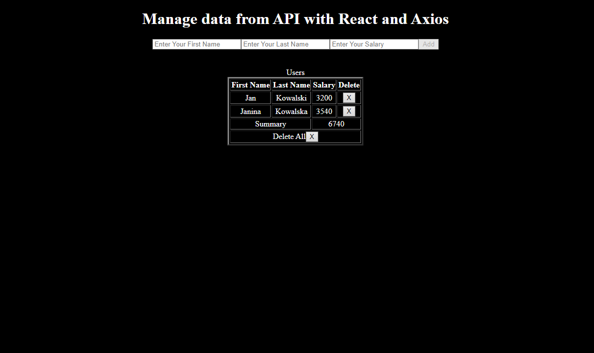

# React todo app

## Table of contents
* [General info](#general-info)
* [Setup](#setup)

## General info
This is simply Todo App made with React and axios module to manage API REST interface.

The application is pretty simple, it contains one component "TodoApp.js" that has class component with state and input fields to pass data. I have displayed them below. 

To handle input fields I have created some asynchronous functions which use axios get, post and delete.

I'm still working on some functionalities...
- [x] Salary sum
- [ ] Delete all todo
- [ ] Search 

## Setup

1. Install axios: `$ npm install axios` or `$ yarn add axios`
2. Instal styled components:  `npm install --save styled-components` or `yarn add styled-components`
3. Install json server globally (if You haven't installed it yet) `npm install -g json-server`
4. Start json local server: `$ json-server --watch db.json`
5. Run application with local host `npm start` or `yarn start`

